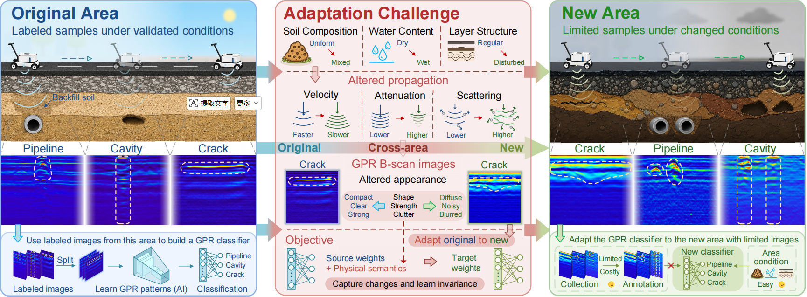
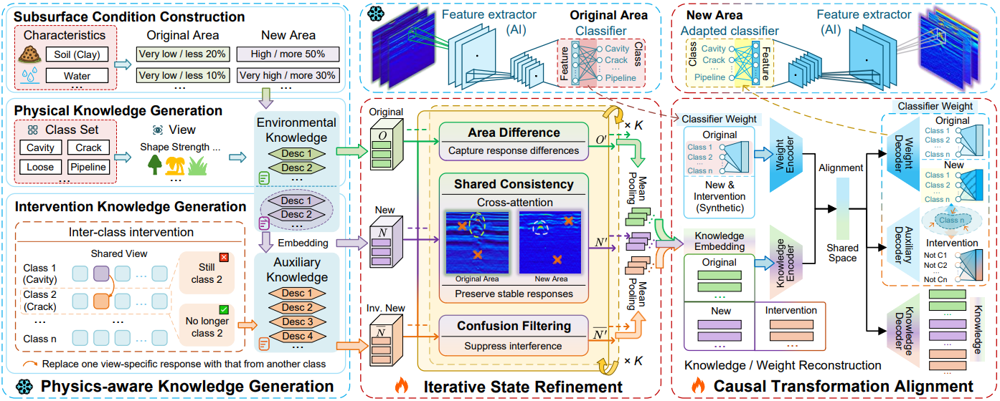
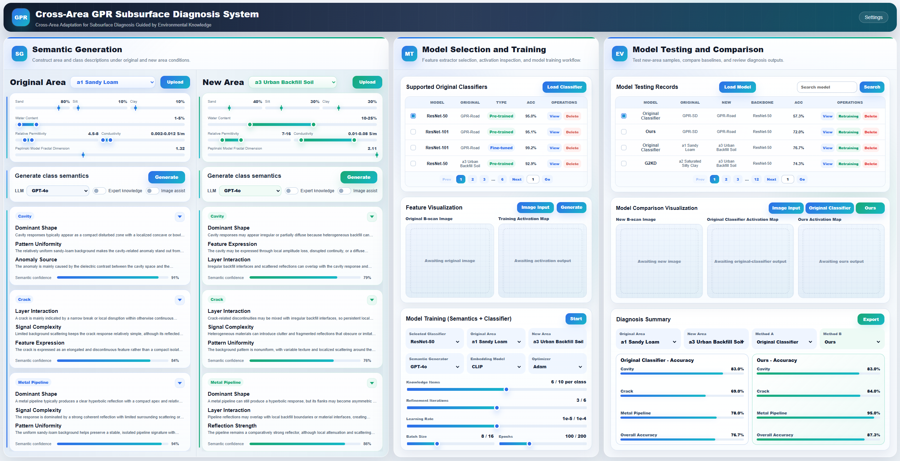

# Cross-Area Adaptation for Subsurface Diagnosis Guided by Environmental Knowledge

This is the repository for "<i>Cross-Area Adaptation for Subsurface Diagnosis Guided by Environmental Knowledge</i>" submission, which provides the implementation and prototype system.

Ground Penetrating Radar (GPR) enables non-destructive inspection of roads and buried infrastructure. However, GPR signals are strongly affected by local subsurface conditions, including soil composition, water content, and road-layer structure. Therefore, a classifier trained in one area may not perform reliably when applied to a new area with different environmental conditions.

Our method incorporates subsurface environmental knowledge to describe how different targets may appear under varying imaging conditions. Based on these descriptions, it adapts an original-area classifier and synthetics classifier weights for a new area, reducing the reliance on labeled data from the new area.

<p align="center">
  
</p>
<p align="center">
  <em>Overview of cross-area GPR subsurface diagnosis under different subsurface conditions.</em>
</p>


The repository contains three connected parts:

- Research code for knowledge generation, classifier training, cross-area adaptation, baseline comparison, and visualization.
- Prepared simulated and real-world GPR datasets, including the collected GPR-SD and GPR-Road datasets. The GPR-SAM and GPR-IRSUV datasets can be obtained from their original sources at [Res-SAM](https://doi.org/10.5281/zenodo.17615326) and [Mendeley Data](https://data.mendeley.com/datasets/ww7fd9t325/1), respectively.
- A Vue + Django prototype system named "<i>Cross-Area GPR Subsurface Diagnosis System</i>" demonstrates the full workflow from the construction of subsurface conditions to knowledge generation and classifier adaptation.

## Repository Structure

```text
submission/
|-- baselines/                       # Baselines (comparison methods)
|-- dataset/                         # Prepared real-world GPR datasets and simulated data
|-- Feature-Generation-datasets/     # Feature generation resources
|-- gprmax_repro/                    # gprMax reproduction scripts for simulation
|-- LLM_desc_gen/                    # Knowledge generation
|-- LLM_query/                       # LLM query utilities or cached query outputs
|-- models/                          # Saved classifiers and models
|-- prompt/                          # Prompt templates
|-- system_backend/                  # Django backend for the prototype system
|-- system_frontend/                 # Vue frontend for the prototype system
|-- sql/                             # Table creation file in the database
|-- utility/                         # Data loading, metrics, and helper utilities
|-- dual_align.py                    # Alignment-related module
|-- main.py                          # Main training and evaluation entry point
|-- regressor.py                     # Classifier/regressor module
`-- requirements.txt                 # Dependencies
```

## Quick Start

The code was developed with Python 3.8, PyTorch, Vue, and Django.

```bash
pip install -r requirements.txt
```

If CUDA is used, install the PyTorch build that matches your local CUDA driver. Most experiment commands assume GPU execution with `CUDA_VISIBLE_DEVICES=0`.


## Overall Framework

<p align="center">
  
</p>
<p align="left">
  <em>
	Overview of the proposed framework, including Physics-aware Knowledge Generation (PKG),
    Iterative State Refinement (ISR), and Causal Transformation Alignment (CTA).
  </em>
</p>


## Detailed Prototype System

The prototype system contains three modules. The following animation provides a brief overview of the complete workflow, including area configuration, knowledge generation, classifier adaptation, feature visualization, and model evaluation.

<p align="center">  
    </p>
<p align="center">  <em>Overview of the Cross-Area GPR Subsurface Diagnosis System.</em></p>

For a complete demonstration with narration and detailed interactions, please <a href="https://github.com/upipes/PipeNet-Expansion/releases/download/v1.0/Demo_video.mp4" style="color:#1f6feb; font-weight:600;">download</a> (or click this image) the demo video for full system (119MB). For further details, please refer to the `Releases` on the right.

[](https://github.com/upipes/PipeNet-Expansion/releases/download/v1.0/Demo_video.mp4)

<p align="center">
  <a href="https://github.com/upipes/PipeNet-Expansion/releases/download/v1.0/Demo_video.mp4" download>
    <strong>Download the demo video for full system ↑↑↑</strong>
  </a>
</p>


### Knowledge Generation

- Load original and new area definitions from the database.
- Upload or input new area information.
- Generate class descriptions with a selected LLM.
- Display category primary views, brief descriptions, and confidence.
- Open class details to inspect all views and detailed descriptions.
- Manage expert annotations for knowledge items.

### Model Selection and Training

- Load supported original classifiers.
- View, delete, import, or retrain classifiers.
- Upload B-scan images and generate activation maps.
- Configure knowledge-guided model training with classifier, areas, LLMs, embedding models, optimizer, learning rate, batch size, and epochs.

### Model Testing and Comparison

- Load model testing records from the database.
- Search, view, delete, import, or retrain testing records.
- Compare original-classifier and proposed-method activation maps.
- Display diagnosis summary and per-class accuracy comparison.

## Frontend

The frontend is implemented with Vue and Element-ui.

```bash
cd system_frontend
npm install
npm run serve
```

The frontend calls the backend API under:

```text
http://127.0.0.1:8000/api
```

## Backend

The backend is implemented with Django and MySQL.

```bash
cd system_backend
python manage.py migrate
python manage.py runserver 8000
```

Default database settings are defined in:

```text
system_backend/gpr_backend/settings.py
```

Default MySQL configuration:

```text
ENGINE: django.db.backends.mysql
NAME:   gpr
USER:   root
PASS:   root
HOST:   localhost
PORT:   3306
```

Create the database before running migrations:

```sql
CREATE DATABASE gpr CHARACTER SET utf8mb4 COLLATE utf8mb4_unicode_ci;
```

Create an admin account if needed:

```bash
python manage.py createsuperuser
```

## Database Content

The system database stores:

- area definitions
- knowledge categories
- knowledge generation runs
- knowledge items
- expert annotations
- original classifier records
- model training/testing records

## Data Preparation

The prepared data are placed under `dataset/`. Before running experiments, make sure the dataset paths used by `main.py` and the utility files match the local directory layout. Specifically:

1. Modify the default values for "--dataroot" and "--rootpath" in `main.py` to specify the path to data and the directory for saving outputs, respectively.
2. Prepare the API key and access URL for LLMs, and modify it in `LLM.py`. Download and prepare the open-source LLMs.

The database stores knowledge generation runs and descriptions with domain, LLM name, expert-knowledge flag, category, primary view, brief descriptions, detailed descriptions, confidence, and generation time.

## Original Classifier Training

Original-area classifiers can be trained through `main.py` or through the Django backend. A typical original-classifier command is:

```bash
$ CUDA_VISIBLE_DEVICES=0 python main_base.py --cuda --manualSeed 0 --dataset=SD --image_embedding=pretrained_resnet50 --class_embedding=llama --factual_branch=attention --intervention_branch=attention --source_only_benchmark --cos_sim_loss --llm=gpt4o --include_new --num_layers 2 --beta1 0.9 --lr 0.00001 --batch_size 8 --embed_dim 2048 --strict_eval --early_stopping_slope --calc_entropy --save_pred_matrix --nepoch=500 --zst --zstfrom=Road --norm_scale_heuristic
```

For `GPR-Road` to `GPR-SD`, use `--dataset=SD` and set `--zstfrom=Road` to the corresponding original area.

## Cross-Area Training

The main training and testing entry point is:

```bash
python main.py
```

The comparison methods include: Original Classifier, wDAE, SubReg, VGSE, ICIS, DANN, ADDA, TPDS, G2KD, Ours.

An example command for the proposed method is:

```bash
$ CUDA_VISIBLE_DEVICES=0 python main.py --cuda --manualSeed 0 --dataset=SD --image_embedding=pretrained_resnet50 --class_embedding=llama --factual_branch=attention --intervention_branch=attention --cos_sim_loss --seperate_loss --llm=gpt4o --include_new --conclude_inv --concatenation --num_layers 2 --beta1 0.9 --lr 0.00001 --batch_size 8 --embed_dim 2048 --strict_eval --early_stopping_slope --calc_entropy --save_pred_matrix --nepoch=500 --view_num=10 --zst --zstfrom=Road --norm_scale_heuristic
```

After training, the backend records the method, original area, new area, backbone, knowledge generator, embedding model, optimizer, learning rate, batch size, epochs, overall accuracy, per-class accuracy, checkpoint path, and timestamps.

## Notes

- The training scripts are GPU-oriented. CPU execution may require removing `--cuda`.
- LLM-based generation requires API keys.
- Model checkpoint paths are stored in the database and reused by visualization endpoints.
- Per-class accuracy files are read from generated output folders when available; otherwise, stored database values are used.

## Submission Notice

This repository is associated with a manuscript currently under review. The code, system interface, demo video, experimental results, and related materials in this repository are provided for academic demonstration purposes only. They remain the intellectual property of the authors. Please do not reproduce, redistribute, commercially use, or publish any part of these materials without prior written permission from the authors. The manuscript and its associated materials may be updated after the review process is completed.
